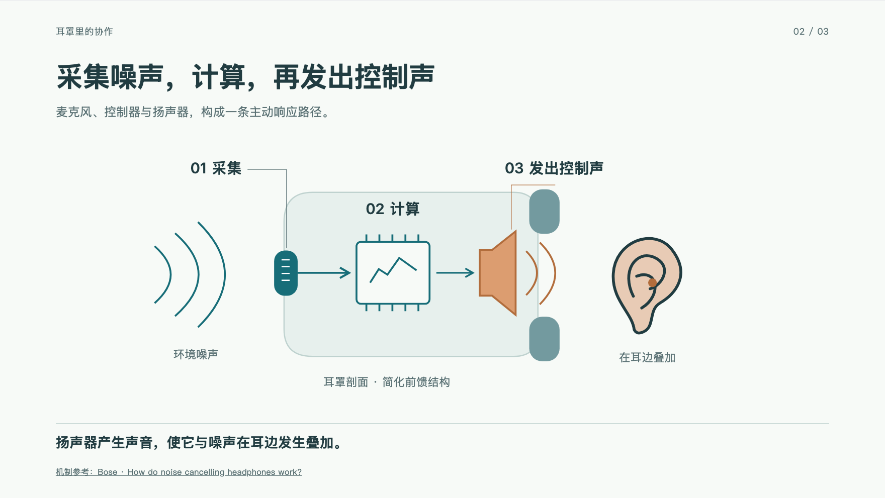
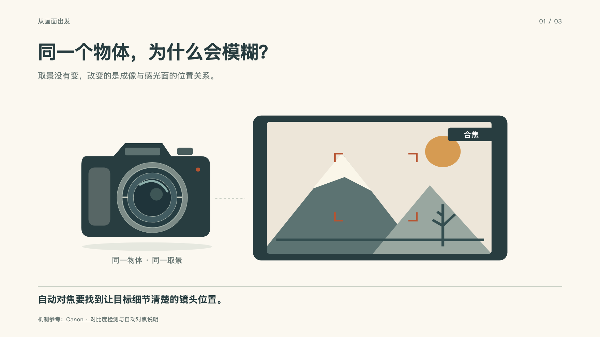
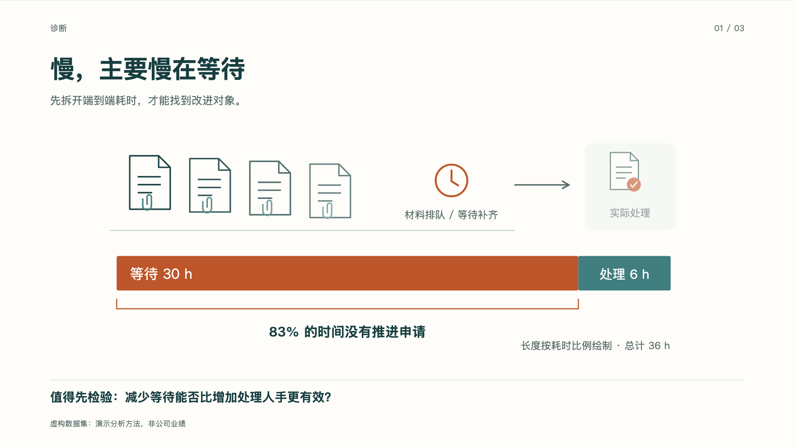
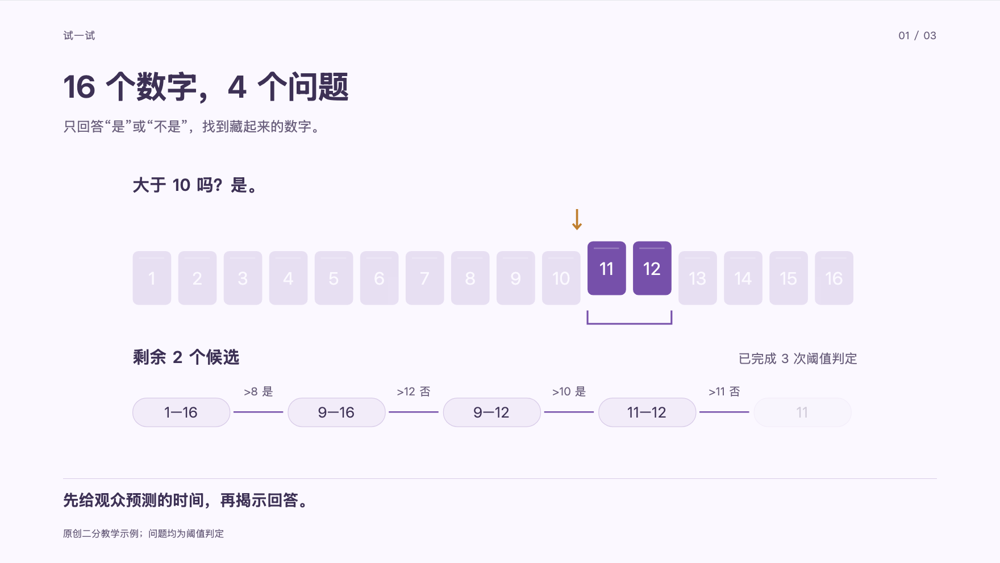

# Presentation Craft

**把想法讲清楚，也画清楚。**

A reusable skill for crafting HTML presentations: audience-led stories, meaningful SVG scenes, coordinated motion, and a single offline HTML file.

`html-presentation-craft` 帮助 AI 从材料中提炼主张，组织讲述顺序，再把内容落实为图示、布局、排版和动画。适用于学术短讲、商业路演、教学、产品介绍与工作汇报；也支持改稿、视觉精修和交付检查。

[下载 Skill](downloads/html-presentation-craft.zip) · [下载演示示例](downloads/presentation-craft-examples.zip) · [阅读 Skill](skills/html-presentation-craft/SKILL.md) · [示例源码](skills/html-presentation-craft/assets/examples/README.md) · [验证记录](docs/verification.md)

## 看看它怎样解释不同主题

<table>
<tr>
<td width="50%"><br><b>科学解释 · 主动降噪</b><br>从耳机外观进入剖面，再把声压叠加连回耳边。</td>
<td width="50%"><br><b>技术机制 · 相机自动对焦</b><br>镜片、光线、焦点与画面清晰度同步变化。</td>
</tr>
<tr>
<td><br><b>业务决策 · 先减少等待</b><br>把申请、队列、耗时与试点连接成可判断的建议。</td>
<td><br><b>互动教学 · 二分思想</b><br>观众跟随候选空间的变化，学会如何排除一半。</td>
</tr>
</table>

四套示例各三页，包含分步动画、讲稿、来源和专门处理的打印状态。场景均为原创 SVG；科学曲线标注为示意，业务数字标注为虚构假设。题材和配色只是示范，制作新演示时应重新判断。

## 它提供什么

- **设计方法**：任务简报 → 叙事大纲 → 分镜 → 视觉方向 → 页面与动画 → 排练检查 → 交付。根据任务规模简化，已有内容确定时直接进入相关环节。
- **视觉解释**：从可识别对象构建场景；图标、实物结构、机制图和数据图各自承担解释任务。
- **可控动画**：完整目标状态，支持前进、后退、深链接与快速操作打断；SVG 路径、几何属性和模糊滤镜可以联动。
- **演示底座**：Vite + React + TypeScript + GSAP + CSS/SVG；16:9 等比舞台、键盘控制、讲稿、总览、计时、全屏及静态打印。
- **离线交付**：构建为 `演示.html`，内嵌正文播放资源，配套讲稿、素材说明与许可。接收者不需要 Node。

这是一份方法与实现结合的 skill，不是保证所有材料一键变成好演示的生成器。人工或模型仍需检查事实、论证、阅读路径、图示准确性和讲述节奏。

## 快速使用

### 让 AI 使用 Skill

将本仓库的 `skills/html-presentation-craft` 整个目录，或 [下载目录](downloads/README.md)中的同名 ZIP 解压后的目录，放入你的工具所支持的 skill 目录。使用 Codex 时通常为 `~/.codex/skills/`。所需指南、starter、示例源码和创建脚本都在包内，不依赖本仓库的其他目录。

调用示例：

> 使用 `$html-presentation-craft`，把这些材料做成面向非专业听众的 8 分钟 HTML 演示。重点讲清问题和方案，采用克制的学术风格，包含机制图、分步动画、讲稿和离线交付。

> 使用 `$html-presentation-craft` 精修这套现有演示，保留已确定的内容。先找出图示、布局和动画的主要问题，再修改并检查关键中间状态。

也可把 [SKILL.md](skills/html-presentation-craft/SKILL.md) 作为其他 AI 编程工具的任务入口，按需读取它链接的参考资料。

### 直接运行一个示例

作者环境需要 **Node.js 22.13+、npm**。以下命令从仓库根目录执行，创建目标必须不存在：

```sh
git clone https://github.com/EricSanchezok/presentation-craft.git
cd presentation-craft
node skills/html-presentation-craft/scripts/create-deck.mjs ../my-anc-talk --example anc
cd ../my-anc-talk
npm ci
npm run dev
```

示例 id 可选 `anc`、`autofocus`、`decision`、`teaching`。省略 `--example` 会创建中性的申请流程场景。修改 `src/deck.tsx` 中的内容、主题、场景与步骤；每页的讲稿和用时也在同一份定义中。

```sh
npm run build
```

最终入口是 **`dist/演示.html`**，不是开发项目的 `index.html`。开发依赖首次安装需要联网，生成的正文播放资源内嵌；来源链接按需联网打开。

## 播放与交付

| 操作 | 按键 |
|---|---|
| 逐步前进 / 后退 | → / ←，PageDown / PageUp；空格前进 |
| 首尾 | Home / End |
| 总览 / 讲稿 | O / N |
| 全屏 / 隐藏控件 | F / P |
| 计时、打印 | 底部控件 |

[下载目录](downloads/README.md)提供两个包：`html-presentation-craft.zip` 是可安装 skill 与完整源码；`presentation-craft-examples.zip` 是可直接观看的四套演示。示例包每个主题目录的最终入口均为 `演示.html`，根目录有 `开始阅读.md`。每个 ZIP 内附 SHA-256 清单，生成时逐文件解压验证。

本地文件双击在不同浏览器上的行为需要接收者确认；本次环境只完成了 HTTP 加载、无额外资源请求及载入后断网播放检查。Safari、Firefox、Windows、跨平台字形和真实投影现场未验证。完整范围与证据见 [验证记录](docs/verification.md)。

## 维护与扩展

```text
skills/html-presentation-craft/   可独立安装的全部内容
  SKILL.md                       简短入口与按需资料索引
  references/                    叙事、图示、排版、动画、实现与交付
  assets/starter/                轻量舞台与构建底座
  assets/examples/               四套原始场景和唯一 catalog
  scripts/create-deck.mjs        安全创建独立项目
examples/                        评审简报与生成预览
scripts/                         构建、检查、预览、打包与仓库治理
tests/                           行为、素材与浏览器验证
docs/                            架构、开发、决策、来源与验证记录
```

[开发指南](docs/development.md) 提供完整命令；[架构](docs/architecture.md) 说明职责；[视觉案例](skills/html-presentation-craft/references/visual-decisions.md) 解释具体取舍；[贡献指南](CONTRIBUTING.md) 说明修改与提交流程。新增示例以 skill 内的 catalog 为准，不维护平行源码副本。repo-seed 驻库治理不会复制到每个演示项目。

## 许可

原创代码、文档和 SVG 场景采用 [MIT](LICENSE)。**GSAP 使用其自身的 Standard License，并非 MIT**；React、React DOM 和其他依赖保留各自许可。生成的演示附第三方许可说明。技术解释引用的网页内容不因本仓库的许可而变为 MIT，详见 [来源与许可说明](docs/provenance.md)。
